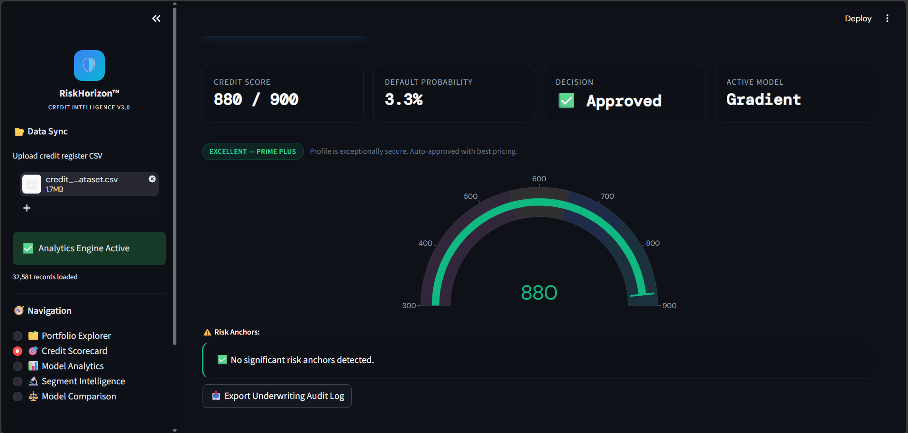
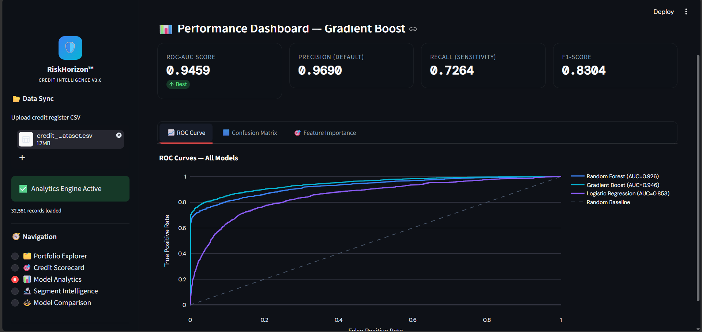

# CodeAlpha_Credit_Scoring_Model
AI-Powered Credit Risk Assessment using Machine Learning

# Credit Scoring Model

## Overview
An AI-powered credit risk assessment system that predicts loan default probability and generates credit scores.

## Features
- Credit Risk Prediction
- Credit Score Generation
- Portfolio Analytics
- Model Comparison
- Interactive Streamlit Dashboard

## Technologies Used
- Python
- Pandas
- NumPy
- Scikit-Learn
- Streamlit
- Plotly

## Models Used
- Random Forest
- Gradient Boosting
- Logistic Regression

## Screenshots
## Dashboard Preview

## Author
Tamil S,
CodeAlpha Machine Learning Intern
